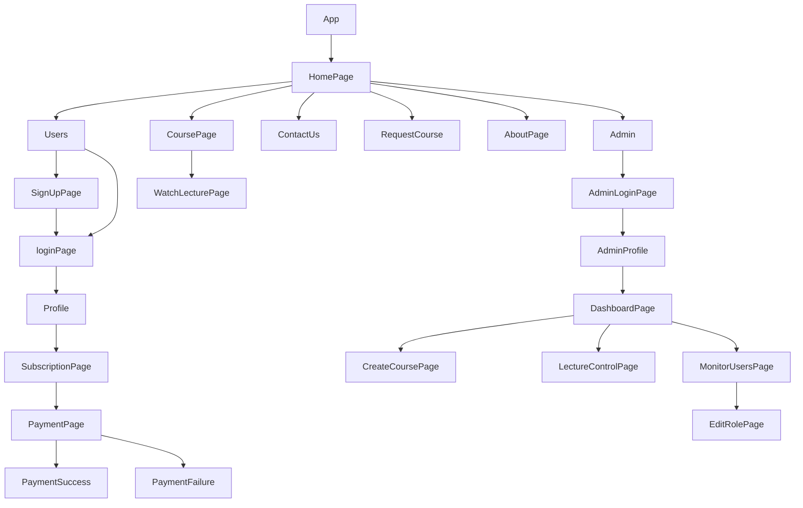

# 💻 PROJECT NAME ✨ => EduMinds💻


---

## ✨ABOUT Project AND THEIR RULES🧑‍💻

⬇️To access the application, please follow these steps:

⭕ **Start the Backend Server:**
Open your terminal and navigate to the backend directory of the project. Use the following command to start the backend server:

  ```sh
  npm run dev
  ```

This command will initialize the backend server, allowing it to handle incoming requests.

⭕ **Start the Frontend Application:**
Open another terminal window and navigate to the frontend directory of the project. Use the following command to start the frontend application:

  ```sh
  npm start
  ```

Once executed, the frontend application will be accessible at http://localhost:3000 in your web browser.

⭕ **User Registration and Login:**
You can sign up as a user by providing your registration details. Additionally, you can log in as an administrator, but please note that the administrator credentials are hardcoded. The credentials are as follows:

   - Name: abc123
   - Email: abc123@gmail.com
   - Password: 123456

⭕ **User Functionality:**
As a user, you have access to various features, including viewing and editing your profile. You can also access all available courses after subscribing and making payments through the integrated Razorpay payment gateway.

⭕ **Admin Functionality:**
Administrators have similar access to user features but cannot purchase subscriptions since they already have administrative privileges. Admins have a separate dashboard where they can monitor user activity, add, delete, and edit courses and lectures, and change user roles.

This application provides a seamless experience for both users and administrators, allowing them to interact with courses and manage user-related tasks efficiently.

Please note that for security reasons, it's essential to use strong and unique passwords and avoid hard-coding sensitive credentials in a production environment. Additionally, consider implementing authentication and authorization mechanisms to enhance the security of your application.


## 💫Tech-Stack->

- #### For Frontend:-
   - `HTML5`
   - `CSS3`
   - `JavaScript`
   - `Redux`
   - `ReactJS`
   - `ES6`

- #### For Backend:-
   - `NodeJS`
   - `ExpressJS`
   - `MongoDB`

- #### For deploy database:-
   - `Render`

- #### For Styling:-
   - `Chakra UI`

- #### For live Project:-
   - `Vercel`

## ⭕Steps to run our Project :

1. ✨Clone the repository.
2. ✨Run the command `npm install` in both the frontend and backend folders.
3. ✨Run the command `npm run server` in the backend folder.
4. ✨Run the command `npm start` in the frontend folder run on localhost:3000.

## Features ✨:

| Serial No | Feature |
| --------- | ------- |
| 1 | User signup and Login, Profile Page for User |
| 2 | Home Page, To request a course |
| 3 | Course page, search & filter course, about page |
| 4 | Watch lecture Page, Add to playlist |
| 5 | Contact page, toggle for dark and light mode |
| 6 | Sidebar, footer, completely Responsive |
| 7 | Views count, monitor subscriber growth, monitor views growth |
| 8 | Profit tracking subscribe and unsubscribe graph |
| 9 | Upload course, delete course, edit course |
| 10 | Upload lecture, delete lecture, edit lecture, edit role |
| 11 | Edit profile, forget the password, reset the password, use of nodemailer |
| 12 | Progress bar, Admin login, Profile Page for Admin |
| 13 | User and admin logout, Dashboard Page |
| 14 | Razorpay integration, buy a subscription for using Razorpay |
| 15 | Navbar, footer, completely Responsive |
| 16 | Demo video, about the game and rules |

## Package.json (Dependency)✨:

| Serial No | Backend | Frontend |
| --------- | ------- | -------- |
| 1 | bcrypt | Chakra-ui |
| 2 | mongoose | React Router dom |
| 3 | cors | redux |
| 4 | dotenv | react redux |
| 5 | express | chartjs |
| 6 | jsonwebtoken | redux thunk |
| 7 | cloudinary | react-hot-toast |
| 8 | cookie-parser | react-chartjs-2 |
| 9 | datauri | protected-route-react |
| 10 | node-cron | react-icons |
| 11 | multer | axios |
| 12 | nodemailer | react-dom |
| 13 | razorpay | react |
| 14 | validator | react-toolkit |

## Flow



<h1 align="center">✨Thank You✨</h1>
